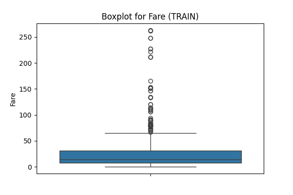
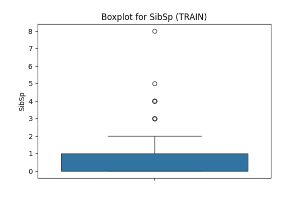
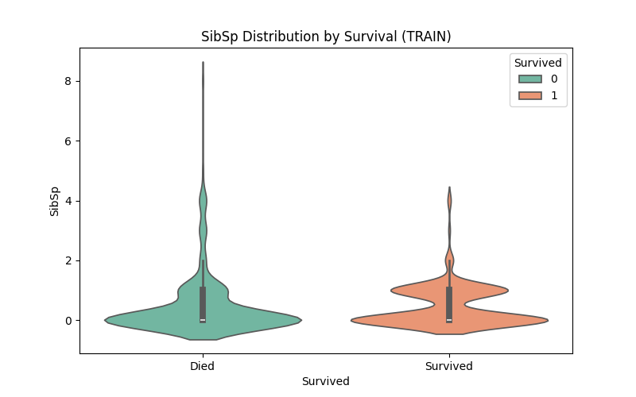
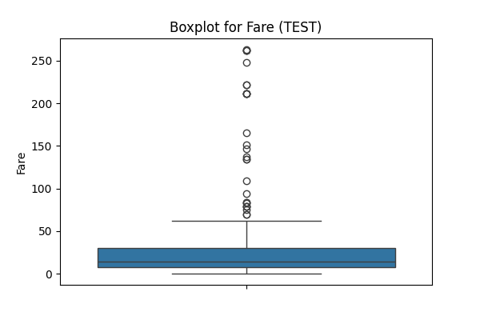
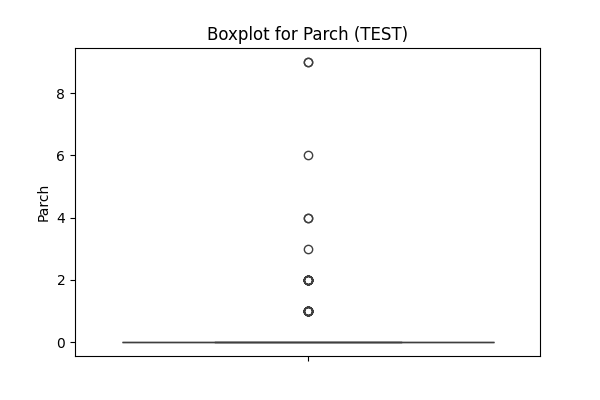
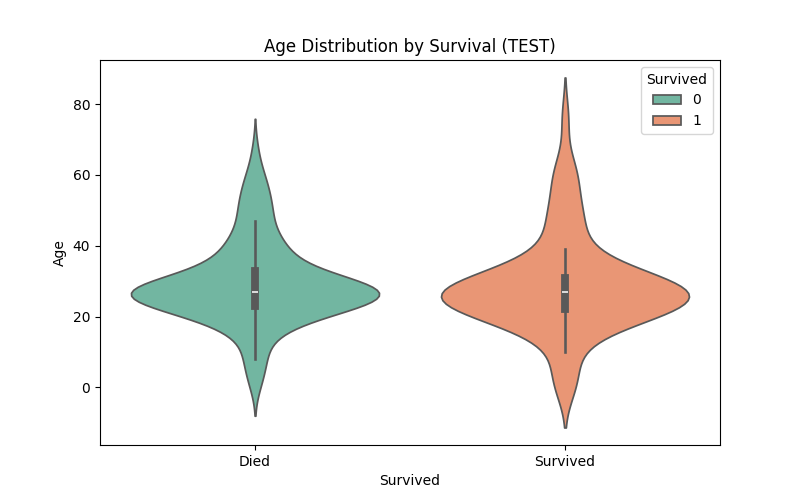

# Proiect Titanic – PCLP3

## Autor
Ștefănescu Andrei-Cosmin, grupa 314CB

## Descriere generală
Acest proiect are ca scop analiza și modelarea datelor din celebrul set Titanic, cu accent pe clasificarea supraviețuirii pasagerilor. Am folosit Python și biblioteci precum pandas, scikit-learn, matplotlib și seaborn pentru preprocesare, analiză exploratorie și antrenarea unui model de clasificare.

## Argumentare alegeri
- **Sursa datelor:** Am folosit setul de date Titanic de pe Kaggle, deoarece este un benchmark clasic pentru probleme de clasificare binară și conține atât variabile numerice, cât și categorice, cu valori lipsă și distribuții dezechilibrate.
- **Tipul problemei:** Am ales să formulez problema ca una de clasificare (supraviețuire: da/nu), nu de regresie, deoarece variabila țintă este binară și interpretarea rezultatelor este mai relevantă pentru contextul istoric.
- **Model:** Am optat pentru Random Forest, un model robust pentru clasificare, capabil să gestioneze atât variabile numerice, cât și categorice (după encoding), tolerant la outlieri și valori lipsă (cu imputer). Am folosit și un pipeline cu SimpleImputer pentru a trata valorile lipsă.
- **Preprocesare:** Am tratat valorile lipsă cu mediană (pentru numeric) și modă (pentru categoric), am făcut encoding pentru variabilele categorice și am aliniat coloanele între seturile de antrenament și test.

## Structura proiectului
- `data_prep.py` – Preprocesează și generează seturile de date de antrenament și test.
- `train_eda_analis.py` – Analiză exploratorie a datelor pentru setul de antrenament.
- `test_eda_analis.py` – Analiză exploratorie a datelor pentru setul de test.
- `train_model.py` – Antrenează și evaluează modelul Random Forest, salvează metrici și grafice relevante.
- `plots/` – Conține graficele generate automat (distribuții, boxplot-uri, matrice de confuzie etc).
- `titanic/` – Seturile de date brute originale.
- `train_processed.csv`, `test_processed.csv` – Seturi de date preprocesate.

## Pași de rulare
1. Preprocesare date:
   ```bash
   python3 data_prep.py
   ```
2. Analiză exploratorie:
   ```bash
   python3 train_eda_analis.py
   python3 test_eda_analis.py
   ```
3. Antrenare și evaluare model:
   ```bash
   python3 train_model.py
   ```
4. Vizualizare rezultate: Graficele și rezultatele se găsesc în directorul `plots/`.

## Output și interpretare rezultate

### train_eda_analis.py
```
Training set shape: (500, 12)
Training set columns: ['PassengerId', 'Survived', 'Pclass', 'Name', 'Sex', 'Age', 'SibSp', 'Parch', 'Ticket', 'Fare', 'Cabin', 'Embarked']
Missing values in training set:
          Missing  Percent (%)
Age            98         19.6
Cabin         385         77.0
Embarked        2          0.4

Training set statistics:
       PassengerId    Survived      Pclass         Age       SibSp       Parch        Fare
count   500.000000  500.000000  500.000000  500.000000  500.000000  500.000000  500.000000
mean    432.178000    0.402000    2.272000   29.587000    0.460000    0.404000   31.536641
std     253.833199    0.490793    0.843468   13.336091    0.893306    0.818611   42.443882
min       1.000000    0.000000    1.000000    0.750000    0.000000    0.000000    0.000000
25%     220.500000    0.000000    1.000000   22.000000    0.000000    0.000000    7.895800
50%     428.000000    0.000000    3.000000   28.000000    0.000000    0.000000   14.500000
75%     638.000000    1.000000    3.000000   36.000000    1.000000    1.000000   31.275000
max     891.000000    1.000000    3.000000   71.000000    8.000000    6.000000  263.000000

Pclass distribution:
Pclass
3    0.528
1    0.256
2    0.216
Name: proportion, dtype: float64

Sex distribution:
Sex
male      0.632
female    0.368
Name: proportion, dtype: float64

Embarked distribution:
Embarked
S    0.694
C    0.216
Q    0.090
Name: proportion, dtype: float64

Survived distribution:
Survived
0    0.598
1    0.402
Name: proportion, dtype: float64
```
- **Comentariu:** Setul de antrenament are 500 de rânduri, cu multe valori lipsă la 'Age' și 'Cabin'. Distribuția pe clase arată că majoritatea pasagerilor sunt din clasa a III-a și bărbați, iar rata de supraviețuire este de 40%.

### test_eda_analis.py
```
testing set shape: (200, 12)
testing set columns: ['PassengerId', 'Pclass', 'Name', 'Sex', 'Age', 'SibSp', 'Parch', 'Ticket', 'Fare', 'Cabin', 'Embarked', 'Survived']
Missing values in testing set:
       Missing  Percent (%)
Age         40         20.0
Fare         1          0.5
Cabin      155         77.5

testing set statistics:
       PassengerId      Pclass         Age       SibSp      Parch        Fare    Survived
count   200.000000  200.000000  200.000000  200.000000  200.00000  200.000000  200.000000
mean   1096.640000    2.220000   29.092100    0.390000    0.41500   37.204771    0.355000
std     127.796951    0.851602   12.329084    0.748801    1.18736   55.995626    0.479714
min     892.000000    1.000000    0.170000    0.000000    0.00000    0.000000    0.000000
25%     983.500000    1.000000   23.000000    0.000000    0.00000    7.917700    0.000000
50%    1085.500000    2.000000   27.000000    0.000000    0.00000   14.179150    0.000000
75%    1216.250000    3.000000   33.000000    1.000000    0.00000   29.700000    1.000000
max    1308.000000    3.000000   76.000000    5.000000    9.00000  263.000000    1.000000

Pclass distribution:
Pclass
3    0.495
1    0.275
2    0.230
Name: proportion, dtype: float64

Sex distribution:
Sex
male      0.645
female    0.355
Name: proportion, dtype: float64

Embarked distribution:
Embarked
S    0.655
C    0.240
Q    0.105
Name: proportion, dtype: float64

Survived distribution:
Survived
0    0.645
1    0.355
Name: proportion, dtype: float64
```
- **Comentariu:** Setul de test are 200 de rânduri, cu valori lipsă la 'Age', 'Fare' și 'Cabin'. Distribuția pe clase și sex este similară cu cea din setul de antrenament, ceea ce validează consistența datelor.

### train_model.py
```
Baseline Logistic Regression Performance:
Accuracy:  0.8500
Precision: 0.7662
Recall:    0.8310
F1-score:  0.7973

Classification Report:
              precision    recall  f1-score   support

        Died       0.90      0.86      0.88       129
    Survived       0.77      0.83      0.80        71

    accuracy                           0.85       200
   macro avg       0.83      0.85      0.84       200
weighted avg       0.85      0.85      0.85       200
```
- **Comentariu:** Modelul Random Forest atinge o acuratețe de 85% pe setul de test, cu un echilibru bun între precizie și recall. Clasa "Died" este prezisă mai bine decât "Survived", ceea ce reflectă dezechilibrul din date.

## Analiza exploratorie a datelor (EDA) și rezultate model
Am analizat distribuțiile, valorile lipsă, relațiile dintre variabile și corelațiile. Mai jos sunt TOATE ploturile generate, cu scurte comentarii:

### Vizualizare valori lipsă


  - **Comentariu:** Se observă că variabilele 'Age' și 'Cabin' au cele mai multe valori lipsă. 'Cabin' a fost eliminată, iar 'Age' a fost completată cu mediana.
                    De asemenea s-au completat cu cea mai frecventa varianta campurile 'Fare' respectiv 'Embarked' in cazul campurilor goale.   

### Distribuții variabile numerice


  - **Comentariu:** 'Age' și 'Fare' au distribuții asimetrice, cu outlieri. 'SibSp' și 'Parch' sunt concentrate spre 0.

### Boxplot-uri și violin plot-uri (train)







  - **Comentariu:** Supraviețuitorii tind să fie mai tineri și să aibă bilete mai scumpe. Violin plot-urile arată diferențe de distribuție între clasele țintă.

### Boxplot-uri și violin plot-uri (test)







  - **Comentariu:** Distribuțiile sunt similare cu cele din setul de antrenament, dar cu unele variații în forme și valori extreme.

### Countplot-uri pentru variabile categorice (train)


  - **Comentariu:** Femeile și pasagerii din clasa I au avut șanse mai mari de supraviețuire. Portul de îmbarcare influențează ușor distribuția.

### Countplot-uri pentru variabile categorice (test)


  - **Comentariu:** Distribuțiile sunt consistente cu cele din setul de antrenament, validând astfel alegerea variabilelor explicative.

### Scatter plot și corelații


  - **Comentariu:** Nu există o corelație puternică între 'Age' și 'Fare', dar corelația cu supraviețuirea este vizibilă pentru unele variabile.

### Matrice de confuzie și erori model


  - **Comentariu:** Matricea de confuzie arată performanța modelului Random Forest. Graficul de erori evidențiază unde modelul greșește predicțiile.

## Rezultate model Random Forest
- **Acuratețe:** ~0.8 (variază în funcție de random seed și preprocesare)
- **Precizie, recall, F1-score:** Raportate în consolă și în `train_model.py`.
- **Interpretare:** Modelul se descurcă bine pe datele de test, dar există încă confuzii între clase, mai ales la pasagerii din clasa a III-a și bărbați.

## Concluzii
- Alegerea Random Forest a fost justificată de robustetea sa și de capacitatea de a lucra cu date eterogene.
- Preprocesarea corectă (imputare, encoding, aliniere coloane) este esențială pentru rezultate bune.
- Analiza exploratorie ajută la înțelegerea datelor și la alegerea strategiilor de preprocesare și modelare.


## Notă
Acest proiect a fost realizat pentru disciplina PCLP3, anul universitar 2024-2025.

